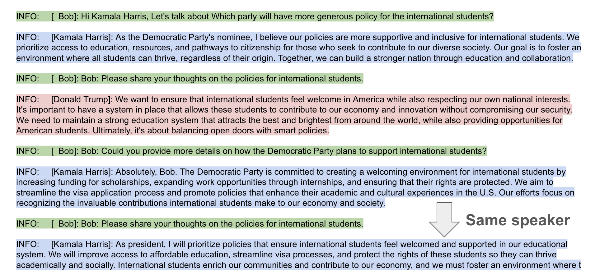
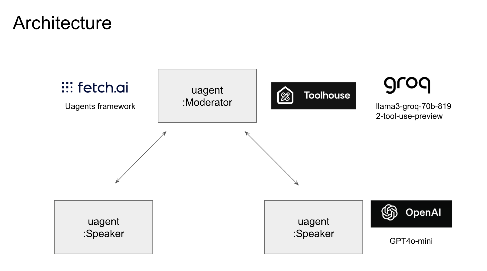

# DeepDive: AI-Powered Multi-Agent Discussions for Informed Decision-Making

## Inspiration
Life is full of complex decisions, from voting to major purchases. For unfamiliar topics, decision-making can be stressful. DeepDive aims to alleviate this by simulating expert discussions, providing users with deeper insights and a more enjoyable decision-making process.

## What it does
DeepDive creates a framework where multiple AI agents, guided by a moderator, engage in discussions on specific topics. Users can observe these dynamic conversations to gain comprehensive insights into their areas of interest.

## How we built it
Utilized the Fetch.AI framework to host and manage multiple agents
Implemented tool capabilities using ToolHouse.ai
Powered by Llama language model hosted on Groq

## Setup

1. Clone the repository:
   ```
   git clone https://github.com/yshk-mrt/agentic_ai_world_hackathon_demo.git
   cd agentic_ai_world_hackathon_demo
   ```

2. Create and activate a Python virtual environment:
   ```
   python -m venv .venv
   source .venv/bin/activate  # For Linux
   # or
   .venv\Scripts\activate  # For Windows
   ```

3. Install required packages:
   ```
   pip install -r requirements.txt
   ```

4. Create a `.env` file and set up necessary environment variables:
   ```
   cp .env.sample .env
   ```
   Edit the `.env` file and set appropriate values.

5. Run the agents:
   ```
   ./run_agents.sh
   ```

## Sample output
**This output is a naive implementation that directly uses LLM output, and does not guarantee any political legitimacy. Please enjoy it as complete fiction.**

The moderator demonstrated the capability of asking a followup question to the same speaker to deepen discussion.


## Architecture

